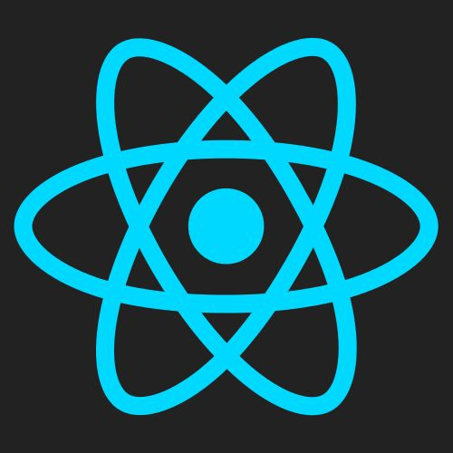

### Hi there 👋 
## Here is what I'm working on and I little bit about me. 

My name is Victor, i'm 27 yo and I'm a developer software student at Trybe and I Work as a Front-end Engineer at Linte_ 

 I speak three different languages: Portuguese, my mother's tongue, Italian and english. I'd studied one year college in USA, and also three months in Italy. There I was able to create a good professional and personal relation with people. Right now, I'm looking foward to improve my carrier and also develop myself. 

  
  ### Technologies:
  - JavaScript
  - HTML5
  - CSS
  - React
  - GraphQL
  - TypeScript
  - NodeJS
  

  
  
  

    
   

   
### Hobbies
 - Soccer/ Goalkeeper
 - Coding
 - Games
 - Bass Player
 - Drawning

Check out below some projects that I'd proudly done: 

